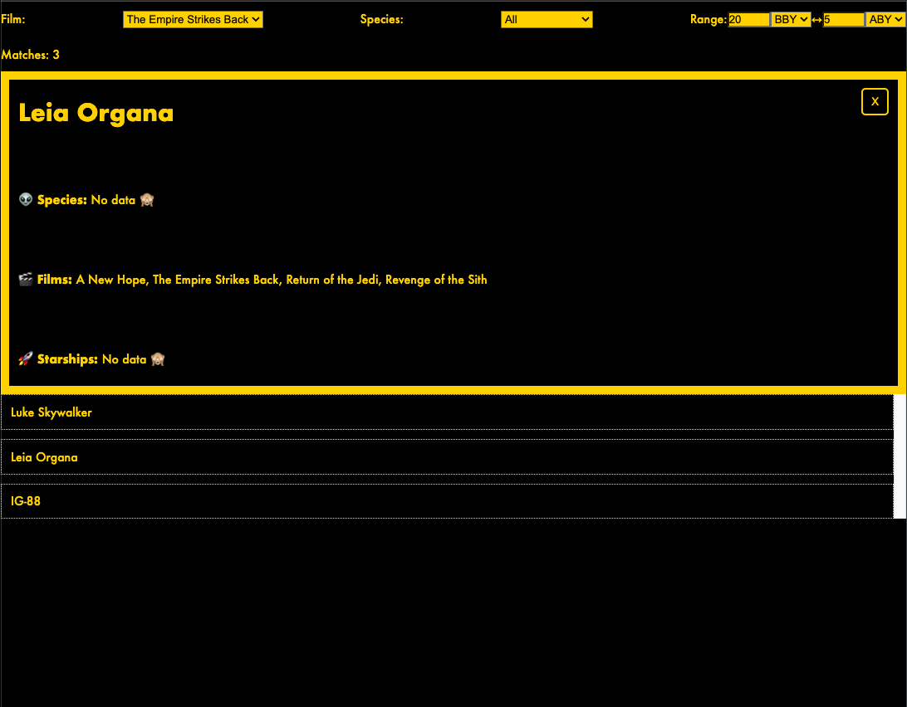

# Filter app leveraging Star Wars API

My attempt at implementing a filter app in React and Vite using the Star Wars API (SWAPI): https://swapi.dev/

## How To

Start: `npm run start`

Test: `npm run test`

## Tech Stack

React, React-router, Vite, JS, CSS only (no UI component library used)

## Misc

- I timeboxed my dev time to around 10 hours. I mainly focused on functionality. Given more time, I would have added a lot more tests.
- I fetch the required data (including the ones required for the filters detail view) when initializing the app at. I do that at the expense of a longer initial loading time. However, once done loading, the filtering and details work locally without any more requests.
- I used Vitest for the few tests which I managed to write in the short time
- Deep linking (e.g. `/details/13`) also works (useful for bookmarking a specific characters details view)
- I used react-router for managing routes

## Screenshot

